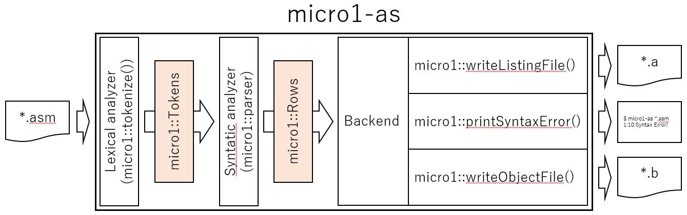

# micro-1as

## Architecture

`micro1-as` receives assembly source code. It generates a listing file and an object code, and outputs syntax errors. It consists of a lexical analyzer, a syntatic analyzer and backends.



## Usage

micro1-as has 2 modes, interactive mode and command line mode. Interactive mode emulates *asm32.exe*, the original assembler. Command line mode has simple interface. Both of modes outputs an object file. However, interactive mode outputs a listing file, and command line mode outputs error message to standard error.

### Interactive mode

If you use `micro1-as` like original assembler, run it without arguments. If assembling is successed, it generates a listing file and an object file. If assembling is failed, only a listing file is generated.

```
$ ./micro1-as
   *** MICRO-1 ASSEMBLER (Ver. 1.0.0.0) ***

 SOURCE FILE NAME ? code.asm # input your assembly code

 START ? # press any key
 NORMAL TERMINATION !

 CONTINUE ? (Y/N):
```

### Command line mode

If you run `micro1-as` with a file name, you get an object file. If assembling is failed, `micro1-as` outputs error messages to standard error.

```
$ ./micro1-as code.asm
```

## documents

If you would like to understand the implementation of `micro1-as`, run `doxygen` in project root directory.

- Lexical analyzer: [lexer.md](lexer.md)
- Syntatic analyzer: [parser.md](parser.md)
