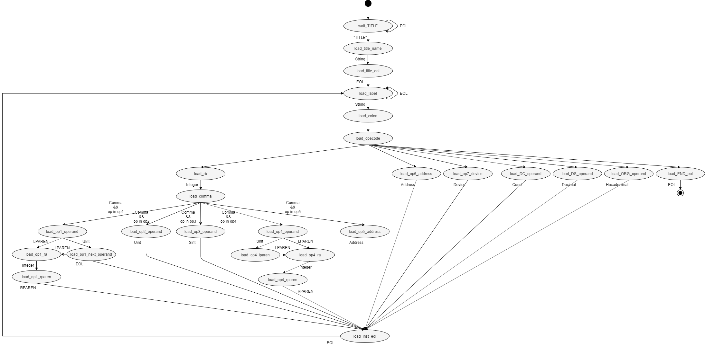

# syntatic analyzer

Related files: include/micro1-as/parser.h, src/parser.cc

## Overview

Syntatic analyzer parses tokens which are generated by [lexical analyzer](lexer.md). It generates `Row` objects.

## State machine figure

The state of `parse()` obey the below figure. If illegal input comes, state goes to load\_label.

